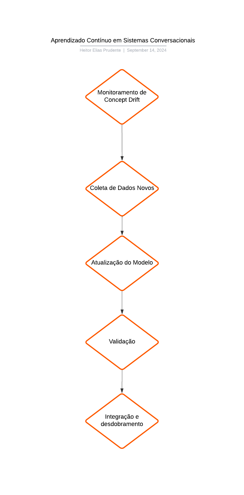

# (Alternativa 1) Proposta de Aprendizado Contínuo em Sistemas Conversacionais

## Introdução
&emsp;&emsp;Nos últimos anos, modelos de linguagem natural (PLN) têm sido amplamente utilizados em uma série de aplicações conversacionais, sendo treinados com grandes corpora de dados para fornecer respostas e interações mais sofisticadas. No entanto, um dos maiores desafios enfrentados por esses sistemas é a obsolescência do conhecimento que eles armazenam. À medida que o mundo muda, os modelos não conseguem acompanhar automaticamente as novas informações, o que resulta em um fenômeno conhecido como concept drift. Esse conceito refere-se à mudança no comportamento dos dados ao longo do tempo, o que pode comprometer o desempenho dos modelos que continuam a operar com base em padrões e informações desatualizadas [1].

&emsp;&emsp;A obsolescência pode ocorrer de várias maneiras, incluindo mudanças nas tendências de linguagem, eventos históricos e sociais ou até mesmo a atualização de normas e regulamentações. Em sistemas conversacionais, isso se torna especialmente crítico, pois a precisão e atualidade das informações são fatores essenciais para interações eficazes [2]. Um exemplo disso é um modelo treinado antes de 2020 que não consegue responder corretamente quem ganhou a eleição presidencial dos EUA, uma vez que os dados de treinamento não incluem essa informação. Esse problema se intensifica em sistemas de aprendizado contínuo, onde a atualização e retenção de conhecimento são desafiadas pela necessidade de evitar a catastrophic forgetting, que ocorre quando novos conhecimentos sobrepõem-se ao conhecimento já adquirido [3].

## Solução Proposta

  Figura 1 - Aprendizado Contínuo em Sistemas Conversacionais
  
  Fonte: Desenvolvido pelo autor (2024)

&emsp;&emsp;Para mitigar os efeitos do concept drift e promover o aprendizado contínuo em sistemas conversacionais, propomos uma arquitetura modular que integra componentes de monitoramento de dados e atualização automática de modelos. A solução é composta por diversos blocos funcionais, cada um com uma responsabilidade específica, conforme descrito abaixo:

- **Módulo de Monitoramento de Concept Drift:** Este bloco é responsável por monitorar constantemente a qualidade das previsões feitas pelo modelo conversacional e detectar possíveis mudanças nos dados de entrada que indiquem concept drift. Para isso, ele compara o desempenho atual com padrões históricos de previsões, identificando quando há uma queda de performance ou discrepâncias significativas nos dados. Quando um drift é identificado, o sistema sinaliza a necessidade de atualização do modelo [4].

- **Módulo de Coleta de Dados Novos:** Uma vez que o concept drift é detectado, o sistema ativa este módulo, que coleta novos dados em tempo real. Esses dados podem ser obtidos por meio de web scraping, APIs externas ou bases de dados específicas que contenham informações recentes. O objetivo é alimentar o sistema com dados atualizados que reflitam as mudanças no ambiente de aplicação [5].

- **Módulo de Atualização do Modelo:** Este bloco é responsável por treinar continuamente o modelo de PLN utilizando os novos dados coletados. Para evitar o catastrophic forgetting, o modelo utiliza técnicas de aprendizado contínuo, como rehearsal, onde amostras do treinamento original são misturadas com os novos dados para garantir que o conhecimento prévio seja preservado [2]. Outra técnica utilizada é a regularização, que impede que os parâmetros do modelo sejam alterados drasticamente durante o treinamento com novos dados [5].

- **Módulo de Validação:** Após a atualização, este módulo valida o modelo treinado para garantir que as novas informações foram corretamente integradas sem perda significativa de conhecimento anterior. Ele realiza testes comparativos entre o modelo atualizado e o anterior, medindo o desempenho em tarefas críticas para o sistema conversacional [4].

- **Módulo de Integração e Desdobramento:** Por fim, o novo modelo é integrado ao sistema conversacional e desdobrado em produção, substituindo o modelo anterior. Durante a integração, este módulo garante a transição suave, realizando verificações finais de consistência e desempenho [5].

## Conclusão
&emsp;&emsp;A proposta de implementação de aprendizado contínuo em sistemas conversacionais visa mitigar os desafios impostos pelo concept drift, garantindo que os modelos de linguagem natural sejam capazes de se atualizar de forma eficiente, preservando o conhecimento já adquirido. A arquitetura sugerida oferece um fluxo contínuo e modular, onde o monitoramento das mudanças nos dados, a coleta de informações atualizadas e a validação cuidadosa asseguram que o sistema permaneça atual e relevante.

&emsp;&emsp;Embora o aprendizado contínuo ofereça muitos benefícios, a sua implementação exige esforços consideráveis, especialmente em termos de infraestrutura e poder computacional. Manter um sistema em constante aprendizado requer mecanismos sofisticados de coleta e processamento de dados, bem como estratégias eficazes de mitigação do catastrophic forgetting. Além disso, garantir a estabilidade e a integridade do sistema após cada atualização é fundamental, demandando tempo e recursos [3].

&emsp;&emsp;Em suma, a implementação de aprendizado contínuo é um caminho promissor para sistemas de PLN, mas exige um planejamento detalhado e investimentos em tecnologias de monitoramento, armazenamento e processamento em larga escala [2].

## Referências

[1] JANG, Joel; YE, Seonghyeon; YANG, Sohee; SHIN, Joongbo; HAN, Janghoon; KIM, Gyeonghun; CHOI, Stanley Jungkyu; SEO, Minjoon. Towards Continual Knowledge Learning of Language Models. 2022. Disponível em: https://arxiv.org/abs/2110.03215. Acesso em: 14 set. 2024.

[2] KIRKPATRICK, James et al. Overcoming catastrophic forgetting in neural networks. Proceedings of the National Academy of Sciences, 2017. Disponível em: https://www.pnas.org/doi/10.1073/pnas.1611835114. Acesso em: 14 set. 2024.

[3] GOODFELLOW, Ian J.; BENGIO, Yoshua; COURVILLE, Aaron. Deep learning. MIT Press, 2016. Disponível em: https://mitpress.mit.edu/books/deep-learning. Acesso em: 14 set. 2024.

[4] PARISI, German I.; KEMKER, Ronald; PART, Jose L.; KANNAN, Christopher; GUMBERT, Stefan. Continual lifelong learning with neural networks: A review. Neural Networks, 2019. Disponível em: https://www.sciencedirect.com/science/article/pii/S0893608019300231. Acesso em: 14 set. 2024.

[5] McCLOSKEY, Michael; COHEN, Neal J. Catastrophic interference in connectionist networks: The sequential learning problem. The Psychology of Learning and Motivation, 1989. Disponível em: https://www.sciencedirect.com/science/article/pii/S0079742108605368. Acesso em: 14 set. 2024.

